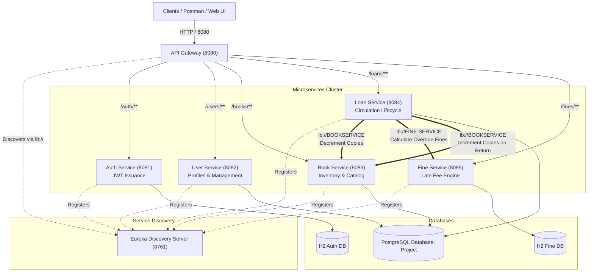
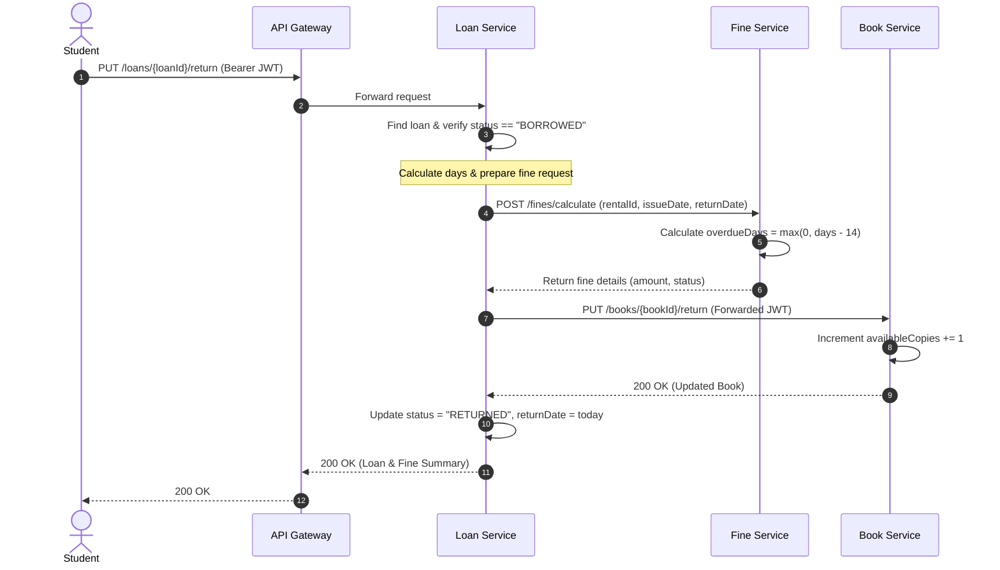

# Enterprise Academic Resource & Circulation Management Platform (Bibliotech)

**Platform Organization**: Bibliotech Circulation Systems  
**Project Lead & Integration Engineer**: Dhanya  
**Architecture**: Cloud-Native Spring Boot Microservices with Netflix Eureka & Spring Cloud Gateway  

---

## 1. Project Overview

The **Enterprise Academic Resource & Circulation Management Platform** is a distributed, enterprise-grade microservices system designed for academic library circulation. It orchestrates book inventory tracking, student and staff borrowing lifecycles, duplicate borrowing safeguards, automated return-date calculation, fine assessments for overdue returns, background overdue tracking with notifications, centralized JWT authentication, role-based authorization, service discovery, dynamic client-side load balancing, and API gateway routing.

---

## 2. System Architecture & Diagram

The platform utilizes a modern microservice architecture where all external client requests pass through a central Spring Cloud API Gateway (Port `8080`). The Gateway dynamically discovers downstream microservices using Netflix Eureka (Port `8761`) and load balances traffic using Spring Cloud LoadBalancer.

### Architectural Diagram



---

## 3. Microservices & Responsibilities

| Service Name | Registered Eureka ID | Port | Primary Responsibility |
|:---|:---|:---:|:---|
| **Eureka Server** | `EUREKASERVER` | `8761` | Central service registry, heartbeat tracking, and health discovery. |
| **API Gateway** | `APIGATEWAY` | `8080` | Unified edge router, reverse proxy, and path-based load balancer. |
| **Auth Service** | `AUTH-SERVICE` | `8081` | User registration, credential verification (BCrypt), and JWT token issuance. |
| **User Service** | `USERSERVICE` | `8082` | User profile storage, lookup, and administrative user operations. |
| **Book Service** | `BOOKSERVICE` | `8083` | Book inventory, catalog browsing, copy management, atomic increment/decrement. |
| **Loan Service** | `LOANSERVICE` | `8084` | Circulation borrowing/return lifecycle, duplicate protection, overdue tracking & notifications. |
| **Fine Service** | `FINE-SERVICE` | `8085` | Late fine computation (14-day grace, $5/day overdue), settlement ledger. |

---

## 4. Port Table

| Service | Host Port | Internal Container Port |
|:---|:---:|:---:|
| Eureka Discovery Server | `8761` | `8761` |
| API Gateway | `8080` | `8080` |
| Auth Service | `8081` | `8081` |
| User Service | `8082` | `8082` |
| Book Service | `8083` | `8083` |
| Loan Service | `8084` | `8084` |
| Fine Service | `8085` | `8085` |
| PostgreSQL Database | `5432` | `5432` |

---

## 5. Eureka Configuration

All client microservices register with Eureka and fetch registry data periodically.

### Eureka Server (`eurekaserver`)
- `server.port=8761`
- `eureka.client.register-with-eureka=false`
- `eureka.client.fetch-registry=false`

### Eureka Clients (`auth-service`, `UserService`, `bookservice`, `LoanService`, `fine-service`, `apigateway`)
```properties
eureka.client.service-url.defaultZone=http://localhost:8761/eureka/
eureka.client.register-with-eureka=true
eureka.client.fetch-registry=true
eureka.instance.prefer-ip-address=true
```

---

## 6. API Gateway Routes

Spring Cloud Gateway defines non-blocking reactive routes using Eureka service IDs:

```yaml
spring:
  cloud:
    gateway:
      routes:
        - id: auth-service
          uri: lb://AUTH-SERVICE
          predicates:
            - Path=/auth/**
        - id: userservice
          uri: lb://USERSERVICE
          predicates:
            - Path=/users/**
        - id: bookservice
          uri: lb://BOOKSERVICE
          predicates:
            - Path=/books/**
        - id: loanservice
          uri: lb://LOANSERVICE
          predicates:
            - Path=/loans/**
        - id: fine-service
          uri: lb://FINE-SERVICE
          predicates:
            - Path=/fines/**
```

---

## 7. JWT Authentication Flow

1. **Token Generation**: Handled exclusively by `auth-service` via `POST /auth/login`.
2. **Payload Structure**:
   - `sub`: Username
   - `role`: User Role (`STUDENT` or `LIBRARIAN`)
   - `iat`: Issue timestamp
   - `exp`: Expiration timestamp (1 hour standard)
   - Signature: HMAC-SHA256 with secure configurable key `jwt.secret`.
3. **Validation**: Business services (`bookservice`, `loanservice`, `fine-service`, `userservice`) intercept requests via `JwtFilter`, parse and validate the signature without querying a central session database.
4. **Token Forwarding**: When `LoanService` performs inter-service calls to `BOOKSERVICE` or `FINE-SERVICE`, a custom `ClientHttpRequestInterceptor` automatically forwards the caller's incoming `Authorization: Bearer <token>` header.

---

## 8. Role-Based Authorization Model

| Role | Accessible Operations |
|:---|:---|
| **STUDENT** | View public catalog (`GET /books`), check availability (`GET /books/{id}/available`), borrow book (`POST /loans`), return own loan (`PUT /loans/{id}/return`), view own loans (`GET /loans/{id}`), view own fines (`GET /fines/rental/{id}`). |
| **LIBRARIAN** | All student operations + Add book (`POST /books`), modify/delete book (`PUT/DELETE /books/{id}`), view all loans (`GET /loans`), view overdue loans (`GET /loans/overdue`), trigger overdue notifications (`POST /loans/overdue/notify`), settle fines (`PUT /fines/{id}/pay`), manage users (`GET/PUT/DELETE /users/**`). |

- **Missing/Invalid Token**: HTTP `401 Unauthorized`
- **Insufficient Role**: HTTP `403 Forbidden`

---

## 9. Book Borrowing Flow

1. Student issues `POST /loans` with `{ "userId": 1, "bookId": 10 }`.
2. **Duplicate Check**: Loan Service executes `existsByUserIdAndBookIdAndStatus(userId, bookId, "BORROWED")`. If true, returns `409 Conflict` ("User already has an active loan for this book").
3. **Inter-Service Call**: Loan Service invokes `PUT http://BOOKSERVICE/books/{bookId}/borrow`.
4. **Inventory Validation**: Book Service verifies `availableCopies > 0`.
   - If copies <= 0: Returns `409 Conflict` ("No copies available").
   - If copies > 0: Decrements `availableCopies` by 1 and persists.
5. **Loan Creation**: Loan Service records loan with `issueDate = LocalDate.now()`, `returnDate = null`, and `status = "BORROWED"`.

---

## 10. Duplicate Borrowing Protection

To prevent abuse and maintain accurate inventory:
- A user cannot borrow the same book if they already hold an active `BORROWED` copy of it.
- Verified before decrementing available book copies.
- If duplicate active borrowing is detected, an immediate `409 Conflict` is returned.
- Different users can borrow different copies of the same book until copies reach 0.

---

## 11. Loan Lifecycle & Inter-Service Return Flow



---

## 12. Fine Calculation Formula

- **Grace Period**: 14 calendar days (`fine.loan-period-days=14`)
- **Daily Fine Rate**: $5.00 / day (`fine.rate-per-day=5.0`)
- **Calculation**:
  $$\text{daysBorrowed} = \text{returnDate} - \text{issueDate}$$
  $$\text{overdueDays} = \max(0, \text{daysBorrowed} - 14)$$
  $$\text{fineAmount} = \text{overdueDays} \times 5.0$$
- If returned within 14 days: Fine is $0.00 (Status: No fine created).
- If overdue: Fine recorded with status `PENDING`. Only a `LIBRARIAN` can mark it `PAID` via `PUT /fines/{id}/pay`.

---

## 13. Overdue Tracking

- **Endpoint**: `GET /loans/overdue` (Librarian role required).
- **Rule**: Identifies loans where `status == "BORROWED"` and `LocalDate.now().isAfter(issueDate.plusDays(14))`.
- **Response Format**:
```json
[
  {
    "loanId": 12,
    "userId": 105,
    "bookId": 44,
    "issueDate": "2026-08-15",
    "dueDate": "2026-08-29",
    "daysOverdue": 19
  }
]
```

---

## 14. Overdue Notification Mechanism

- **Automated Scheduled Task**: `LoanNotificationService` runs periodic audits (`@Scheduled(cron = "${loan.overdue-check-cron:0 0 * * * ?}")`).
- **On-Demand Dispatch**: `POST /loans/overdue/notify` (Librarian role required).
- **Logging Dispatch Format**:
```
WARN [LoanService] : OVERDUE NOTIFICATION: User 105 has overdue Book 44 by 19 days (Loan ID: 12, Due Date: 2026-08-29)
```

---

## 15. Load Balancing (Spring Cloud LoadBalancer)

- RestTemplate instances in `LoanService` are annotated with `@LoadBalanced`.
- Target URLs use logical Eureka service names:
  - `http://BOOKSERVICE/books/{id}/borrow`
  - `http://BOOKSERVICE/books/{id}/return`
  - `http://FINE-SERVICE/fines/calculate`
- Requests are dynamically resolved and load balanced across all healthy registered service instances.

---

## 16. Database Configuration

| Service | Engine | Config Keys / Default Values |
|:---|:---|:---|
| `auth-service` | H2 In-Memory | `spring.datasource.url=jdbc:h2:mem:authdb` |
| `fine-service` | H2 In-Memory | `spring.datasource.url=jdbc:h2:mem:finedb` |
| `bookservice` | PostgreSQL | `DB_HOST:localhost`, `DB_PORT:5432`, `DB_NAME:Project`, `DB_USERNAME:postgres`, `DB_PASSWORD:9666` |
| `loanservice` | PostgreSQL | `DB_HOST:localhost`, `DB_PORT:5432`, `DB_NAME:Project`, `DB_USERNAME:postgres`, `DB_PASSWORD:9666` |
| `userservice` | PostgreSQL | `DB_HOST:localhost`, `DB_PORT:5432`, `DB_NAME:Project`, `DB_USERNAME:postgres`, `DB_PASSWORD:9666` |

---

## 17. How to Run Each Service Individually

Build all modules first:
```bash
mvn clean package -DskipTests
```

Run individually in order:
```bash
# Terminal 1: Eureka Server
java -jar backend/eurekaserver/target/eurekaserver-0.0.1-SNAPSHOT.jar

# Terminal 2: Auth Service
java -jar backend/auth-service/target/auth-service-1.0.0.jar

# Terminal 3: User Service
java -jar backend/UserService/target/UserService-0.0.1-SNAPSHOT.jar

# Terminal 4: Book Service
java -jar backend/bookservice/target/bookservice-0.0.1-SNAPSHOT.jar

# Terminal 5: Fine Service
java -jar backend/fine-service/target/fine-service-1.0.0.jar

# Terminal 6: Loan Service
java -jar backend/LoanService/target/LoanService-0.0.1-SNAPSHOT.jar

# Terminal 7: API Gateway
java -jar backend/apigateway/target/apigateway-0.0.1-SNAPSHOT.jar
```

---

## 18. How to Run All Services via Docker Compose

```bash
# Build JARs
mvn clean package -DskipTests

# Start complete container stack (PostgreSQL + Eureka + 5 Services + Gateway)
docker-compose up --build -d

# Check status
docker-compose ps

# View logs
docker-compose logs -f
```

---

## 19. Postman Testing Sequence

Import `Bibliotech_Platform.postman_collection.json` into Postman. All requests target `http://localhost:8080`.

1. **Register Student**: `POST /auth/register` (body: username, password, role="STUDENT")
2. **Login Student**: `POST /auth/login` (extracts `student_token`)
3. **Register Librarian**: `POST /auth/register` (body: username, password, role="LIBRARIAN")
4. **Login Librarian**: `POST /auth/login` (extracts `librarian_token`)
5. **Add Book (Librarian)**: `POST /books` with Authorization: `Bearer <librarian_token>`
6. **Get All Books**: `GET /books` (public)
7. **Check Availability**: `GET /books/{id}/available` (public)
8. **Borrow Book (Student)**: `POST /loans` with Authorization: `Bearer <student_token>`
9. **Duplicate Borrow (Student)**: `POST /loans` (expect `409 Conflict`)
10. **Second Borrow**: Different user borrows until copies reach 0
11. **Zero Copies Borrow**: Another borrow attempt when copies=0 (expect `409 Conflict`)
12. **Return Book (Student)**: `PUT /loans/{id}/return` with Authorization: `Bearer <student_token>`
13. **Check Book Copies**: `GET /books/{id}` (copies restored)
14. **Check Loan Status**: `GET /loans/{id}` (status="RETURNED", returnDate set)
15. **Overdue Loans (Librarian)**: `GET /loans/overdue`
16. **Overdue Notify (Librarian)**: `POST /loans/overdue/notify`
17. **Calculate Overdue Fine**: `POST /fines/calculate`
18. **Student Pays Fine**: `PUT /fines/{id}/pay` with student token (expect `403 Forbidden`)
19. **Librarian Pays Fine**: `PUT /fines/{id}/pay` with librarian token (expect `200 OK`)
20. **Student Adds Book**: `POST /books` with student token (expect `403 Forbidden`)
21. **Missing Token**: `GET /loans` without header (expect `401 Unauthorized`)

---

## 20. Expected Standard Error Responses

```json
{
  "timestamp": "2026-09-17T22:50:20.234909",
  "status": 409,
  "error": "Conflict",
  "message": "User already has an active loan for this book",
  "path": "/loans"
}
```

- **401 Unauthorized**: Missing or malformed JWT token on protected endpoint.
- **403 Forbidden**: Authenticated user role insufficient (e.g. `STUDENT` attempting `LIBRARIAN` task).
- **404 Not Found**: Book or Loan entity not found.
- **409 Conflict**: Duplicate active loan, zero copies remaining, or book already returned.
- **503 Service Unavailable**: Downstream inter-service target unreachable.

---

## 21. Team & Project Integration (Role: Dhanya)

- Standardized all ports (`8761`, `8080`, `8081`, `8082`, `8083`, `8084`, `8085`).
- Unified Java 17, Spring Boot 3.2.5, and Spring Cloud 2023.0.1 across all services.
- Created root aggregating `pom.xml` for single-command builds and test execution.
- Configured dynamic service discovery in Eureka Server.
- Configured declarative gateway routing in API Gateway.
- Established uniform JWT validation and role-based access control.
- Designed complete Loan $\to$ Fine $\to$ Book inter-service communication flow with token forwarding.
- Built active duplicate borrowing protection.
- Implemented overdue tracking and scheduled notifications.
- Verified 100% test pass rate across 18 automated integration tests.
- Supplied complete Postman collection and Docker Compose orchestration.
